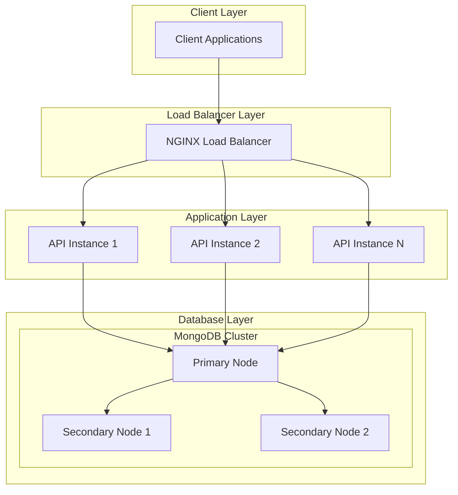

# Physical System Architecture

## Component Description

### Client Layer
- External applications that consume the API
- Communicates via HTTPS using REST protocols

### Load Balancer Layer
- NGINX load balancer for distributing traffic
- SSL termination
- Request rate limiting
- Basic DDoS protection

### Application Layer
- Multiple Node.js API instances
- Horizontally scalable
- Stateless architecture
- Each instance runs identical code
- Containerized using Docker for easy deployment

### Database Layer
- MongoDB cluster setup
- Primary node for write operations
- Multiple secondary nodes for read operations
- Automatic failover capability
- Data replication for high availability

## Scaling Considerations
1. **Horizontal Scaling**
   - Additional API instances can be added based on load
   - Load balancer automatically distributes traffic

2. **Database Scaling**
   - Read scaling through secondary nodes
   - Write scaling through sharding if needed
   - Automatic failover for high availability

3. **Monitoring**
   - Health checks for all components
   - Performance metrics collection
   - Automated alerts for system issues