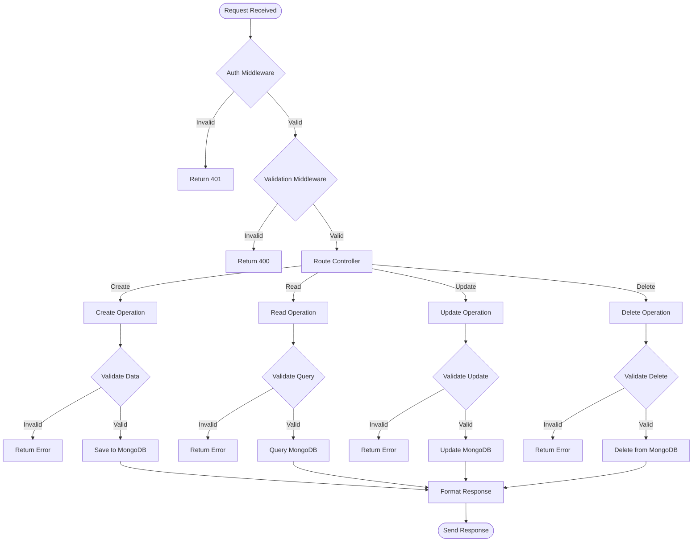

# Software Flow Diagram

## Software Flow Description

### 1. Request Processing
- Request enters the system
- Basic parsing and validation
- Route matching

### 2. Authentication Layer
- Email pattern validation
- Authentication checks
- Request validation

### 3. Route Controllers
- Request handling based on HTTP method
- Parameter extraction
- Business logic coordination

### 4. Data Validation
- Input validation
- Schema validation
- Business rule validation

### 5. Database Operations
- MongoDB interactions
- CRUD operations
- Error handling

### 6. Response Formatting
- Status code selection
- Response structure creation
- Error message formatting

### 7. Response Sending
- Headers setting
- Response compression
- Final response dispatch

## Error Handling
- Validation errors (400)
- Authentication errors (401)
- Not found errors (404)
- Server errors (500)
- Custom error responses 