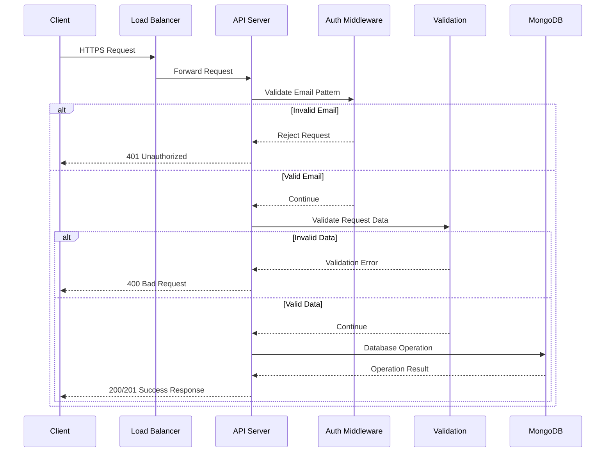

# System Traffic Flow

## Traffic Flow Description

1. **Client Request (HTTPS)**
   - All requests must be over HTTPS
   - Contains authentication headers and payload
   - Includes API version information

2. **Load Balancer Processing**
   - SSL termination
   - Request distribution
   - Basic security checks
   - Rate limiting enforcement

3. **API Server Processing**
   - Request parsing
   - Route handling
   - Business logic execution
   - Response formatting

4. **Authentication & Authorization**
   - Email pattern validation (@afk.no)
   - Request authentication
   - Permission verification

5. **Data Validation**
   - Schema validation
   - Data type checking
   - Required fields verification
   - Date format validation

6. **Database Operations**
   - CRUD operations
   - Data consistency checks
   - Transaction management

7. **Response Handling**
   - Status code selection
   - Response formatting
   - Error handling
   - Success confirmation 